# BLUM v1.1.0 Architecture Review - Trader Brain Refactor

## Brooks-Lint Review

**Mode:** Architecture Audit  
**Scope:** BLUM backend, frontend, runtime workers, snapshots, Learning Loop, Trading Game, Alpha and Paper Copy surfaces  
**Health Score Before:** 55/100  
**Health Score After:** 73/100  

BLUM had strong financial engines but weak conceptual integrity: too many pages and APIs competed to explain the same brain. v1.1.0 keeps the engines and removes product-level fragmentation.

## Module Dependency Graph

```mermaid
graph TD
  subgraph Product_UI
    BrainPage
    TrainingGroundPage
    PaperTradingPage
    AlphaPage
    LegacyInternalPages["Legacy internal pages"]
  end

  subgraph Read_Models
    TraderBrainService
    LearningSummaryService
    AlphaOperatingSystem
    TradingRuntimeSnapshots
  end

  subgraph Core_Engines
    LearningLoop
    TradingGame
    MarketSniper
    DecisionIntelligence
    BusinessQuality
    PortfolioIntelligence
    AlphaRecovery
    MetaCognition
    FinancialBrain
  end

  subgraph Runtime
    CentralBrainRuntime
    EventBus
    SnapshotProducer
    Scheduler
    PerformanceDiagnostics
  end

  subgraph Storage
    PostgreSQL
    DashboardSnapshots
    TradingLedgerSnapshots
    EquitySnapshots
  end

  BrainPage --> TraderBrainService
  TrainingGroundPage --> TraderBrainService
  PaperTradingPage --> TraderBrainService
  AlphaPage --> TraderBrainService
  LegacyInternalPages --> AlphaOperatingSystem
  LegacyInternalPages --> LearningSummaryService

  TraderBrainService --> LearningSummaryService
  TraderBrainService --> AlphaOperatingSystem
  TraderBrainService --> TradingRuntimeSnapshots
  TraderBrainService --> PostgreSQL

  LearningLoop --> PostgreSQL
  TradingGame --> PostgreSQL
  MarketSniper --> PostgreSQL
  DecisionIntelligence --> PostgreSQL
  BusinessQuality --> PostgreSQL
  PortfolioIntelligence --> PostgreSQL
  AlphaRecovery --> PostgreSQL
  MetaCognition --> PostgreSQL
  FinancialBrain --> PostgreSQL

  Scheduler --> LearningLoop
  Scheduler --> TradingGame
  Scheduler --> SnapshotProducer
  SnapshotProducer --> DashboardSnapshots
  TradingRuntimeSnapshots --> TradingLedgerSnapshots
  TradingRuntimeSnapshots --> EquitySnapshots
  CentralBrainRuntime --> EventBus
  CentralBrainRuntime --> DashboardSnapshots
  PerformanceDiagnostics --> PostgreSQL

  DashboardSnapshots --> PostgreSQL
  TradingLedgerSnapshots --> PostgreSQL
  EquitySnapshots --> PostgreSQL

  classDef critical fill:#ff6b6b,stroke:#c92a2a,color:#fff
  classDef warning fill:#ffd43b,stroke:#e67700
  classDef clean fill:#51cf66,stroke:#2b8a3e,color:#fff

  class LegacyInternalPages warning
  class AlphaOperatingSystem,LearningSummaryService warning
  class BrainPage,TrainingGroundPage,PaperTradingPage,AlphaPage,TraderBrainService,TradingRuntimeSnapshots,CentralBrainRuntime,EventBus,SnapshotProducer,Scheduler,PerformanceDiagnostics,PostgreSQL,DashboardSnapshots,TradingLedgerSnapshots,EquitySnapshots,LearningLoop,TradingGame,MarketSniper,DecisionIntelligence,BusinessQuality,PortfolioIntelligence,AlphaRecovery,MetaCognition,FinancialBrain clean
```

## Findings

### Critical - Product-Level Conceptual Drift

**Risk:** Domain Model Distortion  
**Symptom:** The same user goal was split across Dashboard, Learning, Copy Trading, Sniper, Performance, Market Brain and several diagnostic pages.  
**Source:** Brooks - Conceptual Integrity; Evans - Ubiquitous Language.  
**Consequence:** Users could not answer the single question that matters: whether BLUM is becoming a better trader. Each page described part of the system, but no page represented the trader brain as a coherent domain object.  
**Remedy:** v1.1.0 creates four product pages only: Brain, Training Ground, Paper Trading and Alpha. Legacy pages are retained as internal tools but removed from the primary navigation.

### Critical - Competing Read Models

**Risk:** Knowledge Duplication  
**Symptom:** Brain status, learning status, alpha readiness, copy readiness and benchmark truth were assembled independently in multiple pages.  
**Source:** Hunt & Thomas - DRY as single source of knowledge.  
**Consequence:** A user could see one confidence story on Command, a different one on Learning and another one on Copy.  
**Remedy:** `TraderBrainService` is now the top-level read model. It consumes existing evidence services without recalculating or duplicating financial engines.

### Warning - God Router and Model File

**Risk:** Cognitive Overload  
**Symptom:** `backend/app/api/routes.py` is over 2,600 lines and `backend/app/models.py` is over 3,300 lines.  
**Source:** Fowler - Long Method / Large Class; Martin - SRP.  
**Consequence:** Adding endpoints or tables remains risky because unrelated domains share the same files.  
**Remedy:** This sprint avoids increasing the router burden where possible, but the next backend refactor should split API routers by bounded context and move model definitions into domain modules.

### Warning - Legacy Pages Still Exist

**Risk:** Accidental Complexity  
**Symptom:** Internal pages such as Radar, Signal Lab, Performance and Market Brain still exist.  
**Source:** Brooks - Second System Effect; Fowler - Speculative Generality.  
**Consequence:** They remain useful for diagnostics but can pull product focus away from the Trader Brain if promoted again.  
**Remedy:** Keep them reachable by URL for engineering/debugging, but not in primary navigation. Only the four product pages should be user-facing.

## What Was Removed

- Removed the old monolithic Dashboard from the primary product path.
- Removed the old Learning dashboard surface from the primary product path.
- Removed the old Copy Trading page as an independent product surface.
- Removed Radar, Signals, Sniper, Narratives, Charts, Performance and Chat from the primary navigation.

No backend engine, table or API was deleted. This preserves evidence history and backward compatibility.

## What Was Simplified

- The product model is now four pages instead of a platform menu.
- `/dashboard`, `/learning` and `/copy-trading` are lightweight aliases to the new product pages.
- The frontend reads one Trader Brain contract per page.
- The homepage no longer loads market news, radar tables, live sentiment and multiple unrelated widgets.

## What Was Merged

- Brain command, learning summary, alpha readiness, Trading Game readiness and paper copy readiness are merged conceptually into `TraderBrainService`.
- Copy-trading intelligence is merged into Paper Trading as paper-only decision evidence.
- Alpha Recovery, Benchmark Comparison and Edge Map are merged into the Alpha page narrative.

## Why Every Remaining Core Module Exists

- **Learning Loop:** generates point-in-time predictions, evaluates outcomes and produces lessons.
- **Trading Game:** converts decisions into auditable paper P/L and R-multiple evidence.
- **Market Sniper:** defines conditional entry, invalidation and no-trade logic.
- **Decision Intelligence:** evaluates whether BLUM selected the best available opportunity.
- **Business Quality:** measures company quality as a long-horizon decision input.
- **Portfolio Intelligence:** evaluates capital interaction, concentration and risk contribution.
- **Alpha Recovery:** explains why BLUM lost or captured benchmark-relative alpha.
- **Meta-Cognition:** decides which reasoning factors deserve more or less trust.
- **Central Brain Runtime:** observes workers, events and snapshots without heavy computation.
- **TraderBrainService:** unifies the stored evidence into product-grade decisions.

## Brain Architecture

`TraderBrainService` is the master read model. It computes:

- Brain Score
- Decision Quality
- Alpha Readiness
- Learning Progress
- Evidence Quality
- Learning Velocity
- Knowledge Quality
- Current Learning Objective
- Latest Strength / Weakness / Regression
- Next Planned Experiment

It never starts jobs and never writes model improvements.

## Learning Architecture

The Learning Loop remains background-first. The Training Ground page shows:

- current experiment
- current hypothesis
- current validation
- trades being analyzed
- patterns discovered
- patterns rejected
- knowledge gained
- why the model changed
- learning timeline

## Runtime Architecture

The runtime remains snapshot-first:

- background workers run learning and trading jobs;
- snapshot producers make UI-ready summaries;
- pages read compact GET endpoints;
- frontend never triggers training during render;
- diagnostics remain internal.

## Performance Report

Before v1.1.0, the primary dashboard could call many unrelated APIs and mix market monitoring with learning evidence. After v1.1.0:

- Brain page calls `/api/trader-brain/brain`.
- Training Ground calls `/api/trader-brain/training-ground`.
- Paper Trading calls `/api/trader-brain/paper-trading`.
- Alpha calls `/api/trader-brain/alpha`.

This reduces first-paint complexity and keeps heavy work in background workers.

## Training Report

The live system already had stored paper evidence, lessons and readiness states from v1.0.0. v1.1.0 changes how that evidence is interpreted:

- profit is not the master score;
- Brain Score is the master score;
- Decision Quality is separated from outcome;
- Knowledge Quality separates validated learning from raw volume;
- Alpha is always benchmark-relative and evidence-gated.

## Technical Debt Eliminated

- Product navigation no longer exposes every subsystem as a user feature.
- Three heavyweight pages are replaced with aliases.
- The main user path no longer depends on market dashboard data.
- Copy trading is explicitly paper-only and evidence-gated.

## Remaining Debt

- Split `routes.py` into routers by domain.
- Split `models.py` into bounded-context model modules.
- Move old pages under an explicit `/dev` or `/internal` route group.
- Add persisted Brain Score history if the current snapshot history is insufficient.
- Turn autonomous research priorities into a stricter experiment queue.

## Roadmap

1. Persist Brain Score snapshots with calibration and regression deltas.
2. Create a formal experiment ledger for Learning Loop hypotheses.
3. Add paper-copy portfolio simulation using only validated copyability evidence.
4. Build Alpha page live-forward validation thresholds.
5. Split backend routers and domain models to reduce long-term change risk.
