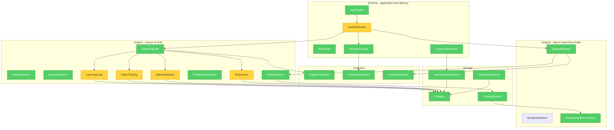

# BLUM v2.0 Architecture Split

## Objective

BLUM v2.0 separates the financial brain from the application shell.

The system is now defined as three contracts:

- **BLUM Engine**: source of truth for decisions, learning, alpha, confidence, memory and datasets.
- **BLUM Analyst**: future trainable reasoning model, fed only by curated Engine datasets.
- **BLUM Runtime**: API, scheduler, snapshots, observability and product interface.

## Brooks-Lint Review

**Mode:** Architecture Audit  
**Scope:** Backend services, API routes, runtime snapshots, dataset export and frontend product boundary  
**Health Score Before:** 60/100  
**Health Score After:** 78/100

The main architectural risk was dependency disorder: product/API code could directly call intelligence services, while future model training had no dedicated boundary. v2.0 adds explicit contracts before moving every legacy service.

## Dependency Diagram

## Findings

### Critical - Intelligence and application delivery shared one import surface

Symptom: `backend/app/api/routes.py` imported dozens of intelligence services directly and exposed product, diagnostics, recalculation and model concerns from one module.

Source: Clean Architecture - Dependency Inversion Principle; Brooks - Conceptual Integrity.

Consequence: New product surfaces could accidentally own financial decisions, and replacing the UI or API client would keep touching intelligence modules.

Remedy: v2.0 introduces `BlumEngineFacade`, `BlumRuntimeFacade` and `BlumAnalystDatasetPipeline`. Existing routes stay compatible, but new integrations use contracts.

### Warning - Legacy services still live in one broad `services` namespace

Symptom: Learning, trading, alpha, chat, runtime, dataset and UI read models remain in `backend/app/services`.

Source: Evans - Bounded Context; Fowler - Large Class / Divergent Change at package level.

Consequence: Developers still need discipline to avoid direct coupling while the physical move is incomplete.

Remedy: Move implementations behind `backend/app/engine`, `backend/app/runtime` and `backend/app/analyst` incrementally. The contracts added in v2.0 define the migration target.

### Warning - Analyst training existed as a script, not a layer

Symptom: `scripts/export_blum_training_dataset.py` imported the financial model service directly.

Source: Pragmatic Programmer - Orthogonality.

Consequence: Future training infrastructure could become coupled to runtime services or database details.

Remedy: The script now calls `BlumAnalystDatasetPipeline`, which emits the `Italianhype/Blum-Analyst` dataset contract and never starts training automatically.

## Communication Contracts

Engine emits:

- decision objects
- paper trade outcomes
- learning events
- alpha status
- brain status
- portfolio status
- curated reasoning datasets

Runtime consumes:

- snapshots
- Engine status
- readiness
- diagnostics
- product-surface payloads

Analyst consumes:

- SFT JSONL
- preference pairs
- DPO pairs
- reasoning traces

Analyst output is never trusted directly. Engine validation remains mandatory.

## Future Migration

1. Move Learning Loop implementation into `app.engine.learning`.
2. Move Trading Game and Paper Copy into `app.engine.paper_trading`.
3. Move Alpha Recovery and Benchmark Intelligence into `app.engine.alpha`.
4. Move Snapshot Producer and performance diagnostics into `app.runtime`.
5. Move training quality/export code into `app.analyst`.
6. Split `routes.py` into runtime routers by bounded context.

## Performance Principle

The split must reduce load:

- Runtime reads snapshots.
- Engine computes in workers.
- Analyst exports datasets on command or schedule.
- No page render triggers intelligence.

