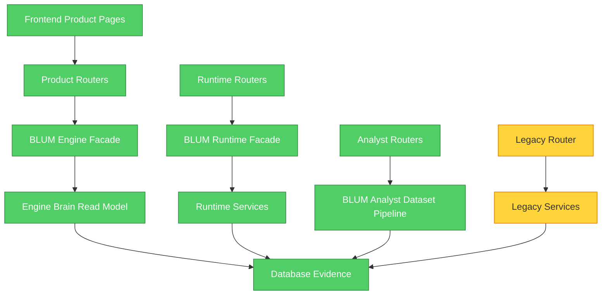

# BLUM v2.1 Clean Core Report

## Objective

BLUM v2.1 reduces runtime coupling around the product core. The goal is not to add financial features, but to make the four primary trader-brain surfaces easier to reason about, test and evolve:

- Brain
- Training Ground
- Paper Trading
- Alpha

## Architecture Review

Before this release, the main API boundary was still `backend/app/api/routes.py`, a large legacy router mixing:

- product endpoints;
- runtime diagnostics;
- analyst/model export endpoints;
- legacy market dashboards;
- administrative actions;
- heavy recalculation endpoints.

That structure violated the clean-core rule because a product request could be conceptually adjacent to low-level services and legacy functionality.

## Dependency Diagram

## What Changed

### Product Routers

Created bounded routers under `backend/app/api/routers/`:

- `brain.py`
- `training.py`
- `paper_trading.py`
- `alpha.py`

These route files call `BlumEngineFacade` only. They do not import low-level intelligence services.

### Runtime Routers

Created `backend/app/api/routers/runtime.py` for:

- runtime status;
- engine status/contracts;
- snapshot health;
- learning health;
- learning summary;
- dashboard snapshots.

### Analyst Routers

Created `backend/app/api/routers/analyst.py` for:

- analyst status;
- architecture contracts.

### Legacy Router

Created `backend/app/api/routers/legacy.py`, which mounts the existing `backend/app/api/routes.py` router after the clean routers. This keeps backward compatibility while making the new route order explicit.

### Physical Engine Migration

Moved the Trader Brain read model physically into:

`backend/app/engine/brain/trader_brain.py`

The old path remains as a compatibility shim:

`backend/app/services/trader_brain.py`

## Why This Improves BLUM

The four product surfaces now depend on:

`Frontend -> bounded API router -> Engine facade -> Engine read model -> stored evidence`

This makes the product path narrower and easier to test. It also prevents new product pages from casually importing legacy services.

## Performance Notes

No heavy computation was added to page render. The primary product endpoints remain read-only and evidence-bound. The v2.1 change focuses on route ownership and dependency direction, not recalculation.

## Known Issues

- `backend/app/api/routes.py` remains large and still contains many legacy endpoints.
- Several Engine modules still physically live under `backend/app/services`.
- Runtime services still live partly under `backend/app/services`.
- The product pages are compact but still fetch live read models, not fully materialized per-page snapshots.

## Next Sprint

1. Move Paper Trading read models into `backend/app/engine/trading`.
2. Move Alpha read models into `backend/app/engine/alpha`.
3. Move runtime snapshot/watchdog/performance code into `backend/app/runtime`.
4. Convert old `routes.py` endpoint groups into explicit `legacy` or `dev` routers.
5. Add performance assertions for each primary product endpoint.
