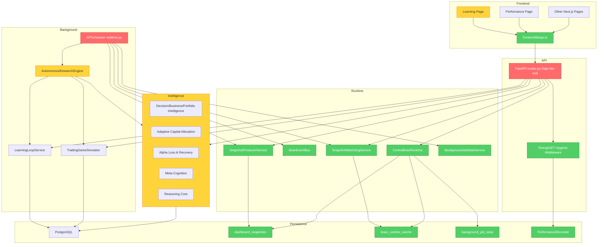
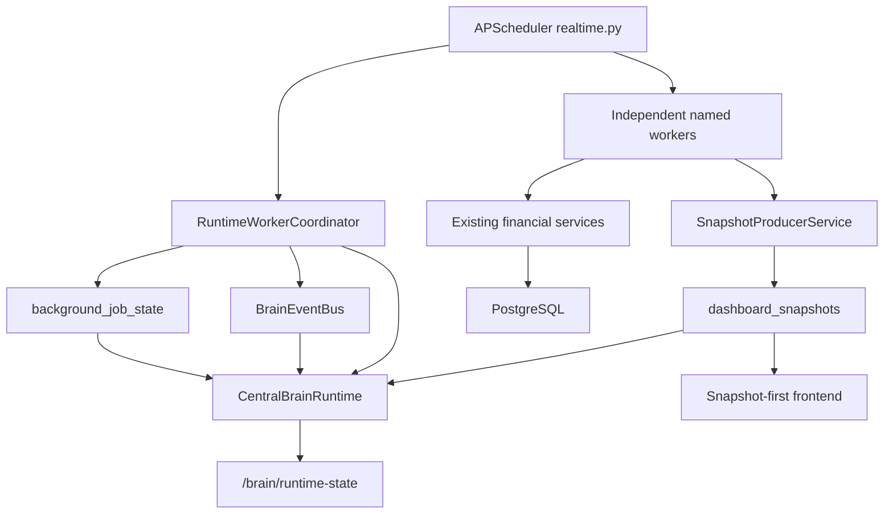

# BLUM v1.0 Runtime Architecture Refactor Report

Generated: 2026-06-24

Updated: 2026-06-29 for the worker-runtime extraction sprint.

Scope: `backend/app`, `backend/alembic/versions`, `frontend/app`, `frontend/lib`, scheduler/runtime services, snapshot services, Learning Loop, Trading Game, Decision Intelligence, Capital Allocation, Alpha Recovery, Meta-Cognition, Chat and Performance diagnostics.

This sprint measures and reduces runtime coupling. It does not add financial features, does not claim performance is fixed, and does not change BLUM's trading or learning algorithms.

## Internal Architecture Map

## Brooks-Lint Architecture Audit

Mode: Architecture Audit

Health Score: 55/100 before the first runtime refactor.

Health Score: 64/100 after worker-runtime extraction. The score improves because unrelated background jobs are no longer forced through one global scheduler lock, but `routes.py` and several composite jobs remain architectural debt.

### Critical Findings

**Dependency Disorder - API route fan-out**
Symptom: `backend/app/api/routes.py` imports almost every model and service, then exposes all modules directly through one router.
Source: Clean Architecture - Dependency Inversion Principle and Stable Dependencies Principle.
Consequence: every new financial engine increases route import fan-out, startup import time and change propagation risk.
Remedy: route new runtime behavior through small orchestration services (`CentralBrainRuntime`, `SnapshotWatchdogService`, `SnapshotProducerService`) and keep financial computation out of generic runtime endpoints.

**Runtime Coupling - global background lock**
Symptom: `backend/app/services/realtime.py` used one `_state["running"]` guard for every scheduled job.
Source: Clean Architecture - Single Responsibility Principle; Pragmatic Programmer - Orthogonality.
Consequence: a long snapshot refresh, market refresh or professional learning cycle could defer unrelated workers even when no real dependency existed.
Remedy: add `RuntimeWorkerCoordinator`, register workers explicitly and block only duplicate runs of the same worker.

**Change Propagation - scheduler runs monolithic jobs**
Symptom: `backend/app/services/realtime.py` schedules full research, market refresh, Learning Loop, model learning and Trading Game work as coarse jobs.
Source: Fowler - Shotgun Surgery / Divergent Change.
Consequence: a failure or slow stage makes the whole worker look failed or stale, and it is difficult to resume where work stopped.
Remedy: persist `background_job_state`, publish runtime events and enforce startup light mode so heavy work is background-first and observable.

### Warning Findings

**Accidental Complexity - snapshots exist but are not centrally produced**
Symptom: `dashboard_snapshots` existed, but producers were scattered and critical snapshots could be missing without a central health view.
Source: Brooks - Conceptual Integrity; Pragmatic Programmer - Orthogonality.
Consequence: frontend screens cannot reliably know whether missing UI data is a true data gap, stale cache or failed producer.
Remedy: add `SnapshotProducerService`, `SnapshotWatchdogService`, `/snapshots/health` and `missing_sections_json`.

**Domain Model Distortion - frontend can still observe compute endpoints**
Symptom: several `GET` endpoints accept `persist=false` flags and can be called with `persist=true`, making reads capable of writes.
Source: Evans - Ubiquitous Language / bounded context drift.
Consequence: a page load can silently become a recalculation path if query params change.
Remedy: instrument `GET_ENDPOINT_SIDE_EFFECT_DETECTED` and keep Learning Overview on `/api/learning-intelligence/summary` only.

**Cognitive Overload - no single runtime state**
Symptom: operational readiness is spread across `/system/status`, `/startup/status`, `/performance/diagnostics`, scheduler memory and individual dashboard endpoints.
Source: McConnell - High-quality routines and information hiding.
Consequence: it is hard to verify whether BLUM is learning, stale, blocked or merely missing snapshots.
Remedy: add `/brain/runtime-state` and `/learning/health` as read-only, composed views.

### Suggestions

**Knowledge Duplication - dashboard status language repeats**
Symptom: readiness/truth/snapshot warnings are assembled in multiple services.
Source: Pragmatic Programmer - DRY.
Consequence: UI panels may disagree on whether a section is stale or missing.
Remedy: centralize snapshot freshness and missing-section reporting in the runtime layer.

## Phase 1 Findings

### Slowest Endpoint Risk

The codebase already records endpoint timing through `PerformanceRecorder`. Actual slowest endpoints must be read from `/performance/diagnostics` in the running Space; this report does not invent measurements.

Structural candidates for slow endpoints:

- `/system/status`: counts a large number of tables on every request.
- `/api/learning-intelligence/dashboard`: full dashboard service, not snapshot-only.
- `/api/trading-game/ledger` with default `limit=200`.
- `/api/trading-game/equity/annotated` with default `limit=800`.
- `/api/decision-intelligence/*`, `/api/business-quality/*`, `/api/portfolio-intelligence/*` when recalculation is requested.

### GET Endpoint Hygiene Risks

Observed `GET` endpoints with optional persistence risk:

- `/api/trading-game/reality-check?persist=true`
- `/api/trading-game/intelligence-metrics?persist=true`
- `/api/trading-game/historical-vs-live?persist=true`
- `/api/sniper/candidates?persist=true`
- `/api/sniper/candidates/{ticker}?persist=true`

Mitigation added: middleware records `GET_ENDPOINT_SIDE_EFFECT_DETECTED` and returns `X-BLUM-GET-SIDE-EFFECT-RISK: true` when a `GET` request contains `persist=true`.

### Missing Snapshot Risks

Critical snapshots now tracked:

- `learning_summary`
- `trading_game_summary`
- `benchmark_summary`
- `intelligence_growth_summary`
- `truth_panel_summary`
- `decision_intelligence_summary`
- `business_quality_summary`
- `portfolio_intelligence_summary`
- `capital_allocation_summary`
- `alpha_recovery_summary`
- `meta_cognition_summary`
- `dashboard_overview_summary`

### Background Job Risks

Before this refactor, job state was mostly process memory plus performance events. Added persistent `background_job_state` and `brain_runtime_events` so restarts and UI diagnostics can see the last job, failure and duration.

### Startup Risk

Before this refactor, `BLUM_ENABLE_LIVE_STARTUP=true` could start heavy pipeline work. Added `BLUM_STARTUP_RUN_FULL_AUTONOMOUS=false` default and a snapshot warm-up path.

## Runtime Refactor Applied

Added:

- `CentralBrainRuntime`
- `BrainEventBus`
- `BackgroundJobStateService`
- `SnapshotProducerService`
- `SnapshotWatchdogService`
- `LearningHealthService`
- `RuntimeWorkerCoordinator`
- `WorkerDefinition` registry for the scheduler workers

Added endpoints:

- `GET /brain/runtime-state`
- `GET /snapshots/health`
- `POST /snapshots/produce`
- `GET /learning/health`

Added tables:

- `brain_runtime_events`
- `background_job_state`

Extended:

- `dashboard_snapshots.missing_sections_json`

Runtime extraction added:

- scheduler state now exposes `running_jobs`, `running_count` and `worker_registry`;
- unrelated workers can run independently;
- duplicate runs of the same worker are deferred as `same_worker_already_running`;
- deferrals are persisted as `module_deferred` events;
- stale `running` jobs from a previous container are marked `interrupted` at startup;
- previous-process failed jobs are archived as `previous_failed` so current health is not blocked by dead process state;
- Central Brain Runtime now reads worker state without importing `realtime.py`;
- the frequent professional Learning Loop lane defers heavy Market Sniper R-multiple simulation to deeper cycles.

## 2026-06-29 Dependency Graph Update

### Full Audit Highlights

- Backend service surface: 152 Python files under `backend`.
- Frontend source surface: 45 TypeScript/TSX files under `frontend`.
- Main API router: 257 route decorators in `backend/app/api/routes.py`.
- Highest fan-out service/router observed: `app.api.routes`, with direct imports from almost every runtime and financial module.
- Largest service files remain `financial_chat.py`, `learning_loop.py`, `reasoning_precision.py`, `market_sniper.py`, `trade_transparency.py`, `blum_financial_model.py`, `financial_brain_learning.py`, `meta_cognition.py`, `trading_game.py`, `alpha_recovery.py`, `learning_intelligence.py` and `trading_intelligence_lab.py`.
- Existing runtime/snapshot migrations are already present (`0024_runtime_architecture.py`, `0025_tg_runtime_snap.py`).
- The primary new bottleneck fixed in this sprint is scheduler-level coupling, not SQL latency.

## Performance Before / After

Measured before/after latency must come from `/performance/diagnostics` after deploy and warm-up. This commit does not claim fixed latency. It makes the runtime measurable and keeps heavy startup work behind configuration.

Expected architectural improvements:

- Learning Overview still performs one primary summary request.
- Snapshot health is readable without recalculation.
- Heavy startup autonomous execution is disabled by default.
- Scheduler jobs publish durable state and module events.
- GET side-effect risks are observable.

## Remaining Bottlenecks

- `routes.py` remains a high fan-out router and should eventually be split by bounded context.
- Some deep dashboard GETs still compute from latest rows instead of snapshots.
- The autonomous research engine still has sequential stages; this sprint records state but does not fully rewrite every stage into cursorized work units.
- `/system/status` still performs many table counts and should be converted to a cached runtime snapshot.

## Next Recommended Step

Use `/performance/diagnostics` after deployment to capture real p95 and top bottleneck data, then move the highest-cost read endpoints to snapshot-first implementations one by one.
