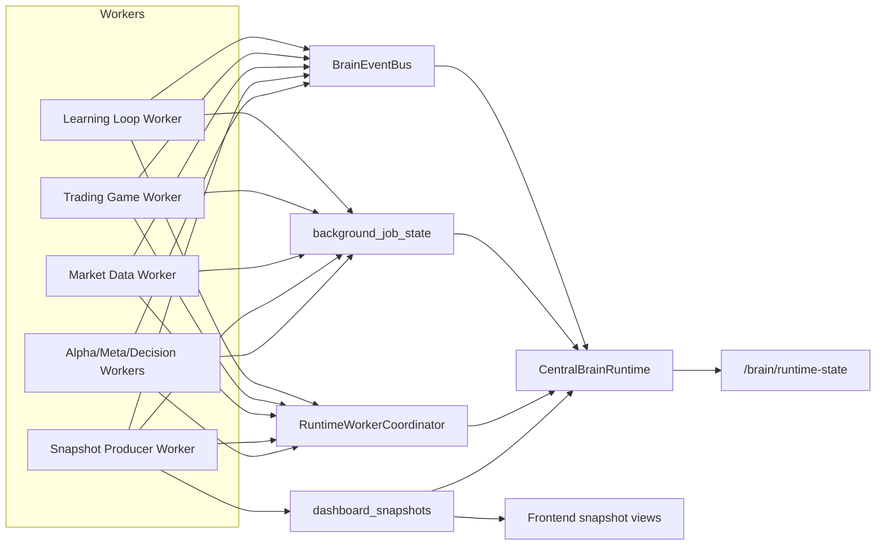
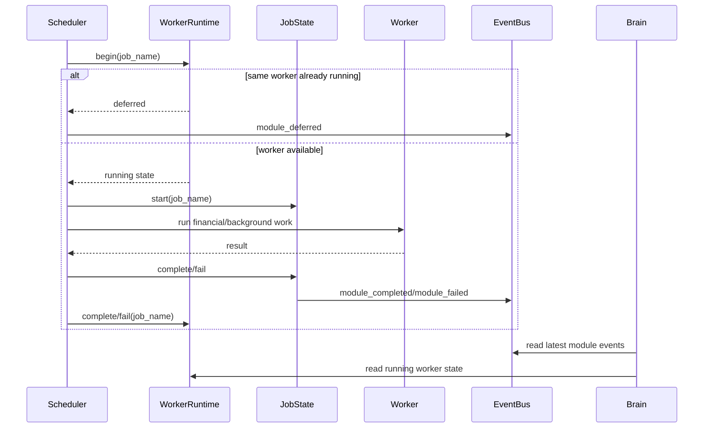
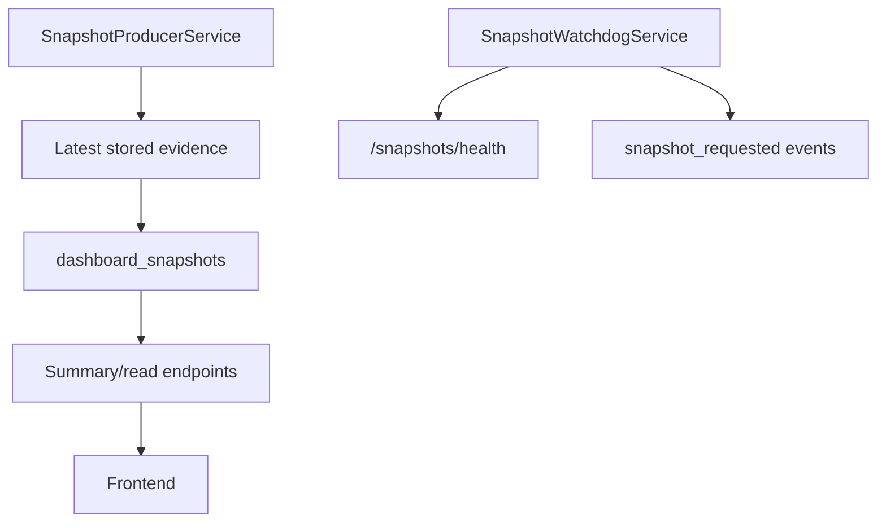

# BLUM v1.0 Runtime Architecture

Version policy: the application version remains `v0.20.0 | market-sniper-engine-v1`.

This document describes the runtime refactor only. It does not change financial behavior, scoring logic, Learning Loop logic, Trading Game logic, Market Sniper logic or API contracts.

## Current Dependency Graph

```mermaid
graph TD
  Browser["Frontend pages"] --> ApiClient["frontend/lib/api.ts"]
  ApiClient --> Routes["FastAPI routes.py"]
  Routes --> RuntimeEndpoints["Runtime endpoints"]
  Routes --> FinanceEndpoints["Financial endpoints"]
  Routes --> TradingEndpoints["Trading Game endpoints"]
  Routes --> ModelEndpoints["Model/Reasoning endpoints"]

  Scheduler["APScheduler realtime.py"] --> MarketWorker["market_refresh"]
  Scheduler --> NewsWorker["news_refresh"]
  Scheduler --> LearningWorker["blum_professional_learning_cycle"]
  Scheduler --> SnapshotWorker["snapshot_producer"]
  Scheduler --> WatchdogWorker["runtime_snapshot_watchdog"]
  Scheduler --> AutonomousWorker["autonomous_research_engine"]

  MarketWorker --> MarketData["MarketDataService"]
  MarketWorker --> SignalEngine["SignalEngine"]
  MarketWorker --> LegacyLearning["Financial Brain Learning"]
  MarketWorker --> LearningLoop["LearningLoopService"]
  MarketWorker --> TradingGame["TradingGameSimulator"]

  LearningWorker --> LegacyLearning
  LearningWorker --> BlumModel["Blum Financial Model"]
  LearningWorker --> LearningLoop
  LearningWorker --> TradingGame
  LearningWorker --> SnapshotProducer["SnapshotProducerService"]

  SnapshotWorker --> SnapshotProducer
  SnapshotProducer --> Snapshots["dashboard_snapshots"]
  WatchdogWorker --> SnapshotWatchdog["SnapshotWatchdogService"]
  SnapshotWatchdog --> BrainEvents["brain_runtime_events"]

  RuntimeEndpoints --> CentralBrain["CentralBrainRuntime"]
  CentralBrain --> BrainEvents
  CentralBrain --> JobState["background_job_state"]
  CentralBrain --> Snapshots
  CentralBrain --> WorkerRuntime["RuntimeWorkerCoordinator"]

  FinanceEndpoints --> DB["PostgreSQL"]
  TradingEndpoints --> DB
  ModelEndpoints --> DB
  LearningLoop --> DB
  TradingGame --> DB
  SnapshotProducer --> DB
```

## Blocking Chains Found

- `routes.py` is still the largest composition root. It exposes every bounded context from one file and should eventually be split, but the current sprint preserves endpoints.
- `realtime.py` previously used one process-wide `running` flag. A slow snapshot, market refresh or learning cycle could defer unrelated jobs.
- `run_market_refresh` and `run_professional_learning_cycle_job` remain composite jobs. Their internal financial order is unchanged for compatibility, but they now run as isolated workers instead of blocking the whole scheduler.
- `CentralBrainRuntime` previously depended on `realtime_status()`, creating a scheduler/runtime import cycle. Learning health now reads the lightweight worker coordinator state.
- Frontend Learning Overview is already snapshot-first. Deep diagnostics and Trading Game tabs remain lazy by design.

## Target Runtime Architecture

Central Brain responsibilities:

- observe worker registry and worker state;
- compose runtime readiness;
- expose missing/stale snapshots;
- expose failed/stale modules;
- expose latest runtime events;
- never run financial computation directly.

Worker responsibilities:

- own its own schedule and runtime slot;
- publish start/completion/failure/deferred events;
- update durable job state;
- checkpoint through existing service-level persistence;
- produce knowledge/snapshots through its own service, not through page render.

## Worker Runtime

`RuntimeWorkerCoordinator` is an in-process worker registry and lock manager.

It replaces the scheduler-wide lock with worker-name isolation:

- duplicate `snapshot_producer` runs are deferred;
- `snapshot_producer` no longer blocks `blum_professional_learning_cycle`;
- `runtime_snapshot_watchdog` no longer blocks `market_refresh`;
- state is visible through `running_jobs`, `running_count` and `worker_registry`.
- stale `running` job rows from a previous process are marked `interrupted` on startup.

Registered workers include:

- `runtime_snapshot_watchdog`
- `snapshot_producer`
- `autonomous_research_engine`
- `news_refresh`
- `market_refresh`
- `data_gap_repair`
- `accuracy_audit`
- `macro_refresh`
- `fundamentals_refresh`
- `ipo_refresh`
- `financial_brain_learning`
- `blum_financial_model_cycle`
- `blum_point_in_time_learning_loop`
- `blum_trading_game`
- `blum_professional_learning_cycle`
- startup warm-up workers

## Event Flow

Events are persisted in `brain_runtime_events`.

Core event flow:

## Knowledge Flow

Financial modules own deep evidence. The Central Brain only consumes metadata:

- latest run state;
- latest status;
- latest snapshot freshness;
- last event per module;
- summary warnings;
- runtime bottleneck pointer.

Deep financial artifacts stay in their bounded services and tables. This avoids turning the Central Brain into another monolith.

## Snapshot Flow

Rules:

- page render never recalculates;
- stale snapshots are returned with warnings;
- missing snapshots are reported, not fabricated;
- manual snapshot production remains explicit through `POST /snapshots/produce`;
- heavy recalculation remains scheduled/manual, not GET-triggered.

## Migration Notes

No destructive migration is required for this refactor. Existing runtime tables are reused:

- `brain_runtime_events`
- `background_job_state`
- `dashboard_snapshots`
- `trading_game_ledger_snapshots`
- `equity_curve_snapshots`

The new worker runtime is in-process and backward-compatible with APScheduler.

## Validation Targets

- `GET /api/learning-intelligence/summary` p95 under 300 ms after warm-up.
- Learning Overview max two initial requests.
- No heavy POST during page render.
- Different workers can run independently.
- Duplicate runs of the same worker are deferred.
- Central Brain reports active workers, missing snapshots, stale modules and readiness.

No performance improvement should be claimed without live `/performance/diagnostics` measurements after deploy and warm-up.
