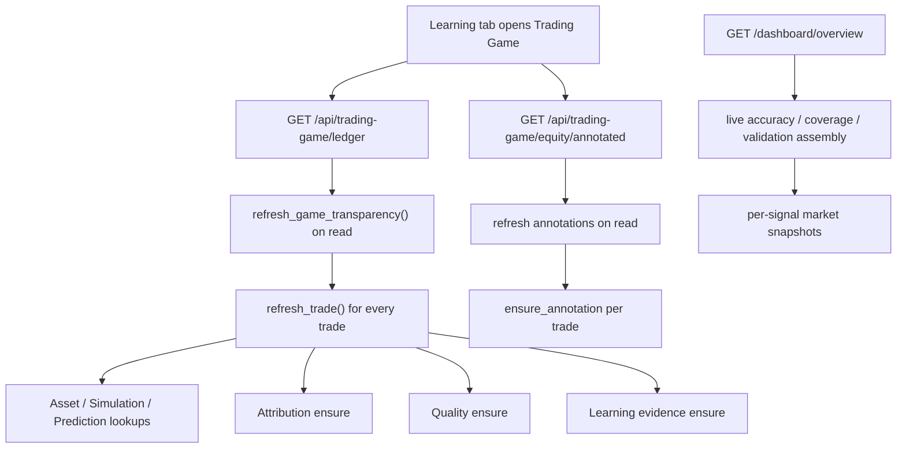

# TRADING GAME N+1 REPORT

Sprint: BLUM v0.20.0 Trading Game Runtime Extraction  
Scope: `GET /api/trading-game/ledger`, `GET /api/trading-game/equity/annotated`, `GET /dashboard/overview`  
Constraint: no financial logic changes, no version change, no feature expansion.

## Architecture Finding

The slow path was not the database engine. The slow path was request-time orchestration.

## Root Cause

### Symptom

The endpoints looked like read endpoints but performed refresh, enrichment and serialization work in the request path.

### Source

- `TradeLedgerService.ledger()` defaulted to `refresh=True`.
- `refresh_game_transparency()` called `refresh_trade()` for every trade.
- `refresh_trade()` performed per-trade lookups and `ensure_*` writes for attribution, quality and learning evidence.
- `EquityCurveAnnotationService.annotated_equity()` rebuilt annotations on GET.
- `dashboard_overview()` assembled accuracy, validation, coverage and per-asset snapshots live.

### Consequence

The system had fast snapshots and a fast database, but the UI still paid the cost of background-style work when opening read-only views.

### Remedy

Move the expensive assembly to snapshot producers and make GET endpoints snapshot-first/read-only:

- `trading_game_ledger_snapshots`
- `equity_curve_snapshots`
- `dashboard_overview_summary`

## Query Count Estimate Before

For a ledger with `N` trades and six attribution engines per trade:

| Area | Before Pattern | Approximate Queries |
|---|---:|---:|
| Base ledger count + rows | bounded read | 2 |
| Refresh all trades | full trade scan | 1 |
| Asset lookup | one per trade | `N` |
| Execution simulation lookup | one per linked trade | up to `N` |
| Historical prediction lookup | one per linked simulation | up to `N` |
| Attribution ensure | six existence checks per trade | `6N` |
| Quality ensure | one existence check per trade | `N` |
| Learning evidence ensure | one existence check per trade | `N` |
| Similar trade ids | one per trade | `N` |
| Equity annotations | up to two existence checks per trade | `2N` |

For `N = 200`, this can exceed 2,600 small queries/writes before serialization.

## Query Count After

Snapshot hit:

| Endpoint | Query Pattern | Expected Queries |
|---|---:|---:|
| `GET /api/trading-game/ledger?limit=25` | latest ledger snapshot | 1 |
| `GET /api/trading-game/equity/annotated?limit=240` | latest equity snapshot | 1 |
| `GET /dashboard/overview` | latest dashboard snapshot | 1 |

Snapshot production still performs bounded batch reads, but it runs outside page render.

## Duplicated Query Patterns Detected

- Repeated `trade_engine_attributions` reads/writes by `(trade_id, engine_name)`.
- Repeated `trade_learning_evidence` reads by `(trade_id, lesson_type)`.
- Repeated `historical_predictions` lookup through execution simulation.
- Repeated `execution_simulations` lookup per trade.
- Repeated `assets` lookup by ticker.
- Repeated `equity_curve_annotations` lookup by `(game_id, related_trade_id, event_type)`.
- Repeated dashboard per-signal market snapshot and accuracy lookup.

## Eager/Batch Loading Opportunities

For future refresh-job optimization, not required for read endpoint speed:

- Batch-load `Asset` rows by ticker before `refresh_trade()`.
- Batch-load `ExecutionSimulation` rows by id.
- Batch-load `HistoricalPrediction` rows by id.
- Batch-load `TradeEngineAttribution` rows by `trade_id IN (...)`.
- Batch-load `TradeLearningEvidence` rows by `trade_id IN (...)`.
- Replace per-trade similar-case queries with grouped setup/regime counts.
- Build equity annotations in bulk with one existing-annotation map.

## Response Size Audit

The new runtime trace records:

- `response_size_bytes`
- row/point/annotation counts
- nested attribution/evidence/quality counts
- JSON generation time
- serialization time

Ledger and equity snapshots keep initial Trading tab payloads bounded; deeper replay/attribution/detail endpoints remain explicit.

## Local Smoke Measurement

Environment: in-memory SQLite test fixture with 2 paper trades, 3 equity points and 1 annotation.

| Surface | Snapshot Produce | Snapshot Read | Read Queries | Payload |
|---|---:|---:|---:|---:|
| Ledger | 5.599 ms | 0.531 ms | 1 | 5,600 bytes |
| Equity annotated | 1.464 ms | 0.622 ms | 1 | 2,601 bytes |
| Dashboard overview | prewritten snapshot | snapshot read | 1 | summary payload |

These are not production p95 values. They verify the runtime shape: snapshot reads are bounded and do not perform per-trade refresh, annotation rebuilds or dashboard live calculations.

## Current Runtime Policy

- GET endpoints do not trigger refresh by default.
- Ledger/equity endpoints read dedicated snapshots first.
- Dashboard overview reads `dashboard_overview_summary`.
- Missing snapshots return partial/stale-safe payloads instead of live recalculation.
- Heavy refresh remains available to background producers and explicit jobs.
