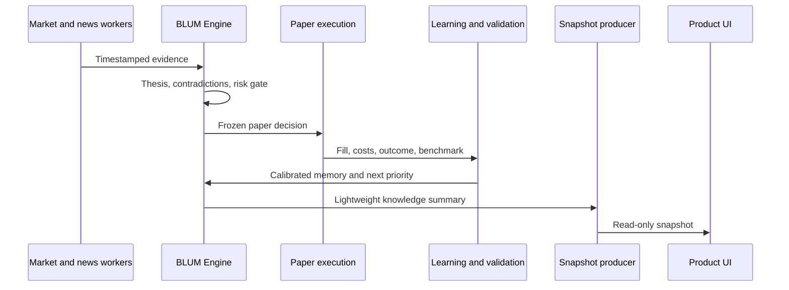

# BLUM Architecture

BLUM separates financial truth, model assistance and application delivery. This
boundary allows the Engine to continue learning when no browser is connected and
prevents UI code from becoming part of a financial decision.

## System boundaries

### BLUM Engine

The Engine is the source of truth for:

- point-in-time evidence and market memory;
- theses, competing views and confidence;
- risk gates, portfolio constraints and capital allocation;
- historical, walk-forward and paper-forward decisions;
- outcomes, benchmark comparison and learning events;
- research priorities and curated model datasets.

Engine modules may publish structured evidence or events. They must not import
frontend components or depend on a page request to run.

### BLUM Runtime

The Runtime owns FastAPI delivery, background scheduling, PostgreSQL lifecycle,
snapshot production, caching, health and the Next.js interface. Product GET
routes read stored evidence or snapshots and do not start learning or financial
recalculation.

### BLUM Finance model

The model is a reasoning assistant trained from quality-gated Engine exports. It
does not own market data, execution state or performance truth. Every model
response must be validated against current Engine evidence before it can affect a
decision.

## Knowledge flow

## Cooperative agents

Agent boundaries clarify evidence ownership without wrapping every service in an
empty abstraction. Market, News, Technical, Fundamental, Pattern, Decision,
Risk, Portfolio, Paper Trading, Learning, Research, Memory, Alpha, Validation and
Dataset agents publish structured outputs that can be tested independently.

Agents do not own UI and do not call one another's heavy computations directly.
Cross-module coordination uses persisted events, contracts and scheduled work.

## Runtime principles

- background-first computation;
- immutable historical evidence;
- bounded, resumable worker jobs;
- snapshot-first product reads;
- partial and stale-but-usable responses;
- explicit model and rule versions;
- no GET-side recalculation;
- no source-code self-modification;
- no fabricated data fallback.

## Persistence

PostgreSQL stores evidence, decisions, outcomes, learning history, worker state
and snapshots. Historical records are append-oriented. Derived snapshots are
replaceable read models and never the source of financial truth.

## Detailed references

- [Runtime architecture](../RUNTIME_ARCHITECTURE.md)
- [v2 architecture split](../ARCHITECTURE_SPLIT_v2.0.md)
- [Clean Core report](../CLEAN_CORE_REPORT_v2.1.md)
- [Performance refactor report](../PERFORMANCE_REFACTOR_REPORT.md)
- [Project reference archive](PROJECT_REFERENCE.md)
