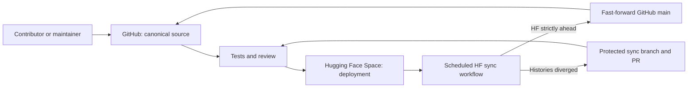

# BLUM GitHub Public Surface and Hugging Face Sync Design

**Date:** 2026-08-03

**Status:** Approved design

**Scope:** Repository presentation, discoverability, community documentation and
safe Hugging Face-to-GitHub synchronization. Financial behavior is unchanged.

## Objective

Make `BlumFinancialLab/Blum` the professional, canonical open-source home of
BLUM while preserving Hugging Face as the public deployment and model ecosystem.
The change must improve discoverability and contributor confidence without
creating a second source of truth or allowing automated synchronization to
overwrite divergent work.

## Source-of-truth model

GitHub is the canonical source repository. Hugging Face remains the deployed
Space and can still receive commits produced through the HF interface or an
existing deployment workflow.

The synchronization contract is deliberately asymmetric:

- a strict fast-forward from HF may update GitHub automatically;
- a divergent HF history must never force-push or overwrite GitHub;
- divergence creates or refreshes a review branch and pull request;
- a GitHub-only change does not cause the HF-to-GitHub workflow to modify
  either repository;
- deployment from GitHub to HF remains an explicit maintainer operation unless
  a separately governed HF credential is configured.

## Public repository information architecture

The root README becomes a concise product and engineering landing page rather
than a cumulative release log. It contains:

1. BLUM identity and evidence-bound positioning;
2. visible badges for license, Space, model, Python and application stack;
3. direct links to the live product, model, datasets and documentation;
4. the four product surfaces: Brain, Training Ground, Paper Trading and Alpha;
5. a compact architecture diagram;
6. explicit statements about what BLUM does and does not do;
7. reproducible local and Docker quick starts;
8. current evidence and safety boundaries without performance hype;
9. documentation, contributing, security and license links;
10. finance and research disclaimers.

The existing long README is preserved as historical project documentation under
`docs/PROJECT_REFERENCE.md`. This avoids deleting institutional knowledge while
removing more than two thousand lines of release detail from the first public
screen.

Additional public documents:

- `docs/ARCHITECTURE.md`: current Engine, Runtime, Analyst and evidence flow;
- `docs/DEPLOYMENT.md`: local, Docker, HF and synchronization operations;
- `docs/RESEARCH_METHODOLOGY.md`: point-in-time evidence, benchmark and no-alpha
  guardrails;
- `SUPPORT.md`: routing for support, bugs, discussions and vulnerabilities;
- `CITATION.cff`: machine-readable project citation;
- `.github/CODEOWNERS`: ownership of core financial, runtime and model paths;
- issue-template configuration that routes questions to Discussions.

## SEO and discoverability

SEO is descriptive, not promotional. Repository metadata and README language
will consistently use terms that accurately describe the project:

- open-source financial intelligence;
- quantitative finance;
- algorithmic and paper trading;
- financial machine learning;
- evidence-bound AI agents;
- backtesting and benchmark validation;
- Forex and equities research;
- FastAPI, Next.js and Hugging Face.

GitHub repository topics are expanded within the platform limit. The homepage
remains the live HF Space. Claims such as guaranteed alpha, daily market
outperformance or production copy-trading readiness are prohibited.

## Synchronization workflow

The workflow runs on `workflow_dispatch` and a bounded schedule. It uses the
standard `GITHUB_TOKEN` with `contents: write` and `pull-requests: write` and
reads the public HF Git remote without an HF secret.

Algorithm:

1. checkout `main` with full history and Git LFS support;
2. fetch `refs/heads/main` from the public HF Space;
3. stop successfully when commit IDs match;
4. stop successfully when HF is already an ancestor of GitHub;
5. if GitHub is an ancestor of HF, push required LFS objects and fast-forward
   GitHub `main` to HF `main`;
6. if histories diverge, publish HF head to a deterministic `sync/hf-main`
   branch and create or update one pull request;
7. write a clear job summary with both commit IDs and the selected action.

The workflow must not:

- force-push `main`;
- merge unrelated histories;
- expose credentials;
- run application recalculations;
- deploy financial logic;
- modify source files during synchronization.

Concurrency is limited to one sync job. Repeated scheduled runs are idempotent.

## Failure handling

- HF unavailable: fail the workflow with no repository modification.
- Missing HF `main`: fail with a diagnostic summary.
- LFS transfer failure: do not advance GitHub `main`.
- Pull request already open: update the existing branch and reuse the PR.
- GitHub branch protection rejects fast-forward: preserve the HF commit on the
  sync branch and open a PR instead.
- Conflicting workflow runs: cancel the older run through a concurrency group.

## Validation

Static validation:

- Markdown links resolve to tracked files or public URLs;
- YAML workflows and issue templates parse;
- no placeholder or secret signature is introduced;
- README remains concise and renders without raw diagnostic output.

Workflow validation:

- equal histories select `noop_equal`;
- HF behind selects `noop_hf_behind`;
- HF strictly ahead selects `fast_forward`;
- divergence selects `pull_request`;
- decision logic is tested without network access;
- workflow has explicit least-privilege permissions and concurrency.

Release validation:

- local, GitHub and HF main revisions are recorded;
- GitHub recognizes Apache-2.0 and all community health files;
- repository metadata and topics are visible publicly;
- the HF Space returns HTTP 200 after the documentation deployment;
- no financial or model behavior changes as part of this work.

## Compatibility and migration

No API, database, model, learning, trading or frontend contract changes. Existing
documentation remains available in the project reference. Existing Git remotes
remain `origin` for GitHub and `hf` for the Space.

Contributors should clone GitHub. Maintainers may continue to inspect HF commits,
but any divergent HF change must be reviewed through the generated pull request.

## Success criteria

- a first-time visitor can understand BLUM, run it and find its evidence policy
  in under two minutes;
- the root README is a focused public landing page;
- GitHub community-health and citation metadata are complete;
- repository metadata uses accurate high-value search terms;
- HF-originated fast-forward commits reach GitHub automatically;
- divergent histories never overwrite canonical work;
- workflow behavior is tested and observable;
- the same application commit remains deployed and no financial logic changes.
