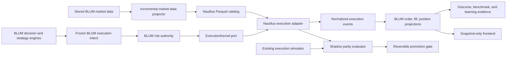

# BLUM Deterministic Execution Core Design

**Date:** 2026-08-03  
**Status:** Approved for implementation planning  
**Scope:** Historical replay, walk-forward validation, and paper-forward execution for equities, ETFs, and fiat Forex  
**Excluded:** Crypto assets, broker-connected real-money execution, frontend-triggered computation, source-code self-modification, and version changes

## 1. Objective

BLUM will retain ownership of market reasoning, hypotheses, confidence, strategy promotion, capital allocation, and learning. NautilusTrader 1.230.0 will supply a deterministic execution substrate for historical replay and paper-forward execution.

The integration must answer one measurable question:

> Does using the same deterministic order, risk, accounting, and portfolio semantics across replay and paper-forward reduce execution divergence and improve the reliability of BLUM's evidence?

The integration does not claim or guarantee alpha. It improves the validity of the evidence used to decide whether alpha exists.

## 2. Why Integration Is Preferred

BLUM already contains financial intelligence that NautilusTrader does not provide:

- thesis and contradiction reasoning;
- Learning Loop and Research Planner;
- signal and strategy memory;
- confidence calibration;
- alpha loss attribution;
- Decision Superiority;
- Business Quality;
- strategy promotion and quarantine;
- paper-trading evidence surfaces.

BLUM currently lacks one shared deterministic execution runtime. Equity, intraday, and Forex flows use related but separate lifecycle implementations. Reimplementing a complete order management, risk, accounting, and event system in Python would duplicate mature infrastructure and increase execution risk.

NautilusTrader provides a Rust-native deterministic kernel, event ordering, instrument types, order lifecycle, execution engine, risk engine, portfolio accounting, cache, and Parquet data catalog. The stable 1.230.0 Python wheel supports the Python version used by BLUM.

## 3. Architectural Decision

Use a ports-and-adapters integration. BLUM domain services depend on a BLUM-owned `ExecutionKernel` protocol. The Nautilus implementation is an infrastructure adapter and does not leak Nautilus types into Learning Loop, Trading Game, or API contracts.



## 4. Ownership Boundaries

### BLUM owns

- candidate selection and ranking;
- setup classification and thesis generation;
- entry, invalidation, stop, target, and holding-horizon intent;
- confidence and evidence quality;
- risk budget and portfolio allocation policy;
- strategy promotion, quarantine, and retirement;
- benchmark choice;
- learning and model-memory updates;
- user-facing snapshots.

### Nautilus adapter owns

- deterministic event ordering and clock semantics;
- instrument precision and quantity normalization;
- order lifecycle and state transitions;
- order matching in backtest and sandbox contexts;
- partial fills and duplicate-fill protection;
- bracket and contingent order behavior;
- execution-side risk validation;
- cash, margin, position, and P/L accounting inside a run;
- execution and portfolio events returned to BLUM.

### Nautilus does not own

- signal generation;
- strategy confidence;
- alpha claims;
- Learning Loop weights;
- database truth after projection;
- public APIs;
- frontend orchestration.

## 5. Core Contracts

BLUM will define immutable contracts independent of Nautilus:

- `InstrumentSpec`: canonical symbol, venue, asset class, quote/base currency, price precision, quantity precision, tick size, lot size, and account mode.
- `MarketEvent`: timestamped quote, trade, or bar with source and point-in-time acquisition metadata.
- `ExecutionIntent`: frozen decision identifier, instrument, side, order type, quantity, prices, time-in-force, contingency rules, and risk context.
- `KernelRunRequest`: environment, starting balances, instruments, market events, execution intents, and deterministic seed.
- `KernelOrderEvent`: initialized, denied, accepted, triggered, partially filled, filled, canceled, rejected, or expired.
- `KernelPositionEvent`: opened, changed, reduced, or closed.
- `KernelRunResult`: events, final portfolio state, costs, diagnostics, and reproducibility fingerprint.

`ExecutionKernel` exposes:

```python
class ExecutionKernel(Protocol):
    def run_replay(self, request: KernelRunRequest) -> KernelRunResult: ...
    def run_paper_step(self, request: KernelRunRequest) -> KernelRunResult: ...
    def health(self) -> KernelHealth: ...
```

All contracts are serializable and validate unknown fields strictly. BLUM persists its contracts and normalized results, not opaque Nautilus objects.

## 6. Data Catalog

`NautilusMarketDataProjector` incrementally projects stored BLUM evidence into a Parquet catalog:

- `ReplayMarketBar` becomes Nautilus `Bar` data;
- eligible point-in-time quote evidence becomes `QuoteTick` data;
- `PriceHistory` is permitted for daily replay only;
- Forex symbols become fiat `CurrencyPair` instruments;
- stocks and ETFs become `Equity` instruments;
- crypto rows are rejected by policy;
- source timestamps and acquisition timestamps remain distinct;
- projector cursors prevent rescanning immutable history;
- duplicate data is rejected using deterministic event keys;
- data later than the simulation clock is never loaded into a run.

The existing PostgreSQL database remains the application source of truth. Parquet is a derived, rebuildable execution catalog.

## 7. Strategy and Order Translation

`BlumDecisionStrategyAdapter` converts a frozen BLUM trade plan into deterministic order intent:

- market, limit, stop-market, and stop-limit entries;
- `DAY`, `GTC`, `GTD`, `IOC`, and `FOK` time-in-force where applicable;
- entry plus stop-loss and targets as a bracket/OTO-OCO structure;
- trailing exits where the frozen plan defines them;
- reduce-only exits;
- cancellation or expiry when the trigger window closes;
- no implicit entry when confirmation was not observed.

The adapter cannot change confidence, invent prices, or relax risk limits. Unsupported intent is denied explicitly and stored as evidence.

## 8. Risk and Portfolio Bridge

`BlumNautilusRiskBridge` applies two independent gates:

1. BLUM portfolio authority checks risk budget, correlation, drawdown, concentration, benchmark context, and strategy readiness.
2. Nautilus validates instrument precision, quantity, balances, notional, order rate, reduce-only behavior, expiry, and trading state.

The stricter decision wins. An order denied by either layer remains denied.

Supported trading states:

- `ACTIVE`: normal paper submission;
- `REDUCING`: only risk-reducing orders;
- `HALTED`: cancel and observe only.

Forex uses hedging semantics only when the configured paper venue supports it; equity and ETF paper portfolios default to netting. Currency conversion must use stored point-in-time FX evidence or deny the accounting operation.

## 9. Event Projection and Recovery

`NautilusExecutionProjector` translates normalized kernel events into existing BLUM tables:

- `PaperExecutionOrder`;
- `PaperExecutionFill`;
- `LiveForwardPaperTrade`;
- `LiveForwardPaperTradeEvent`;
- position and portfolio snapshots;
- learning evidence after terminal outcomes.

Projection is idempotent. Event identifiers, trade identifiers, and reproducibility fingerprints prevent duplicate fills. A failed projection resumes from the last persisted event cursor. Existing public API payloads remain compatible.

## 10. Shadow Mode and Promotion

Nautilus starts in `SHADOW` mode. For the same frozen decisions and point-in-time data, BLUM runs the existing engine and Nautilus independently.

`ExecutionParityEvaluator` compares:

- accepted or denied state;
- fill/no-fill result;
- fill timestamp;
- filled quantity;
- average fill price;
- spread, slippage, commission, FX, and borrow costs;
- exit reason and timestamp;
- realized P/L and R-multiple;
- position and cash state.

Promotion to `AUTHORITATIVE_PAPER` requires all of:

- at least 100 terminal shadow comparisons;
- equities/ETFs and Forex both represented;
- at least three market regimes;
- zero duplicate-fill or impossible-fill violations;
- zero look-ahead violations;
- order-state agreement of at least 99%;
- median fill-price divergence no greater than 5 bps for equities/ETFs and 1 pip for major Forex pairs;
- P/L reconciliation error below 0.1%;
- no material regression in worker duration or API latency;
- explicit persisted promotion decision.

Promotion is reversible. Any invariant violation or statistically material divergence returns the adapter to `SHADOW` or `QUARANTINED`. Existing execution remains available as fallback until authoritative promotion is validated.

## 11. Runtime and Performance

Nautilus work runs only in bounded background jobs. GET endpoints and frontend mounts never instantiate a kernel or project data.

Runtime rules:

- package pinned to `nautilus_trader==1.230.0`;
- no `2.0.0rc1` pre-release;
- no crypto extras;
- no Interactive Brokers extra in this paper-only release;
- kernel initialized lazily by a worker;
- maximum items and runtime budget per job;
- checkpoint after every batch;
- derived catalog stored under the persistent BLUM data directory;
- health and parity summaries written to dashboard snapshots;
- worker failure cannot stop API, Learning Loop, or existing paper trading;
- dependency absence produces `UNAVAILABLE`, not application startup failure.

Initial performance targets:

- execution snapshot read p95 below 300 ms;
- no additional requests during initial page render;
- projector does not rescan completed partitions;
- replay throughput and memory are measured before any performance claim;
- Space startup remains API-first and does not build the catalog synchronously.

## 12. Configuration

The release adds explicit reversible configuration:

```text
BLUM_NAUTILUS_ENABLED=true
BLUM_NAUTILUS_MODE=shadow
BLUM_NAUTILUS_ASSET_CLASSES=equity,etf,forex
BLUM_NAUTILUS_CRYPTO_ENABLED=false
BLUM_NAUTILUS_AUTHORITATIVE_AUTO_PROMOTE=true
BLUM_NAUTILUS_MIN_PARITY_SAMPLES=100
BLUM_NAUTILUS_MAX_JOB_SECONDS=120
BLUM_NAUTILUS_MAX_ITEMS_PER_JOB=5000
BLUM_NAUTILUS_CATALOG_PATH=/data/blum/nautilus/catalog
BLUM_NAUTILUS_FALLBACK_ENABLED=true
```

Auto-promotion can only select `AUTHORITATIVE_PAPER`; it can never enable real-money execution.

## 13. Observability

The adapter publishes lightweight runtime evidence:

- kernel availability and version;
- mode: unavailable, shadow, authoritative paper, or quarantined;
- catalog cursor and freshness;
- runs, events, orders, fills, and terminal comparisons;
- throughput, duration, memory, and failure count;
- parity agreement and divergence distributions;
- look-ahead, duplicate-fill, accounting, and reconciliation violations;
- current blocker and next background action.

The Paper Trading snapshot may display this summary using existing surfaces. No new product page is required.

## 14. Safety and Evidence Rules

- No real-money or broker-connected execution.
- No crypto instruments or adapters.
- No future data may enter replay or paper decisions.
- No Nautilus result becomes learning evidence before projection and validation.
- No fallback result is mislabeled as Nautilus output.
- No alpha claim follows from higher replay throughput.
- No strategy promotion follows from execution parity alone.
- No hidden parameter or source-code mutation.
- All promotion and rollback actions are persisted and explainable.
- Historical results remain immutable.

## 15. Testing

The implementation requires:

- contract serialization and strict validation tests;
- instrument mapping for equity, ETF, and fiat Forex;
- explicit crypto rejection;
- point-in-time catalog projection tests;
- deterministic replay tests with repeated identical fingerprints;
- market, limit, stop, bracket, partial-fill, cancel, and expiry tests;
- duplicate-fill rejection;
- risk-state and precision denial tests;
- cash, position, P/L, and FX reconciliation tests;
- shadow parity tests;
- promotion and rollback tests;
- empty database and missing package behavior;
- worker budget and resume tests;
- GET read-only tests;
- existing paper-trading and Learning Loop regression tests;
- Docker build and Hugging Face startup verification.

## 16. Licensing and Naming

NautilusTrader is consumed as an unmodified dynamically imported PyPI dependency under LGPL-3.0. BLUM documentation will preserve license notices, link to the upstream source, and describe the integration as third-party use without endorsement.

The BLUM component is named `BLUM Deterministic Execution Core`. It must not use NautilusTrader trademarks as a product or package prefix, and it must not use upstream logos.

## 17. Definition of Done

The integration is complete when:

1. Equities, ETFs, and fiat Forex map into canonical instruments.
2. Stored point-in-time data can run deterministic Nautilus replay without future leakage.
3. Frozen BLUM decisions produce normalized order and position events.
4. Existing BLUM order/fill/trade records are projected idempotently.
5. Shadow parity evidence is persisted and snapshot-readable.
6. Promotion and rollback are automatic, reversible, and evidence-gated.
7. Learning consumes only terminal validated outcomes.
8. No GET or frontend render triggers Nautilus computation.
9. Existing BLUM tests remain green except documented pre-existing failures.
10. Deployment starts successfully on the Hugging Face `cpu-basic` Space.
11. Performance is reported from measurements rather than inferred from Nautilus architecture.

## 18. Primary References

- https://nautilustrader.io/docs/nightly/concepts/architecture/
- https://nautilustrader.io/docs/latest/concepts/backtesting/
- https://nautilustrader.io/docs/latest/concepts/execution/
- https://nautilustrader.io/docs/latest/concepts/data/
- https://nautilustrader.io/docs/latest/concepts/events/
- https://nautilustrader.io/docs/latest/concepts/portfolio/
- https://github.com/nautechsystems/nautilus_trader
- https://github.com/nautechsystems/nautilus_trader/blob/develop/TRADEMARK.md
